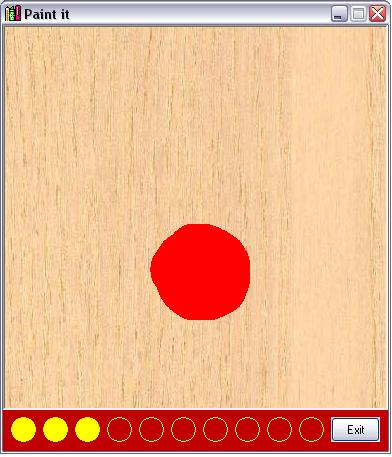



## Paint it

### Description

this is a small game in which ur target is to paint all the wall and after 10 second from playing it calculate the percentage of painting u have done and there is a top percentage list to write your name int if u make a heigh score

this game is funny and it's code is easy.
 
### More Info
 

             |
---                |---
**Submitted On**   |2005-06-18 01:33:30
**By**             |[Ahmed Kotb](https://github.com/Planet-Source-Code/PSCIndex/blob/master/ByAuthor/ahmed-kotb.md)
**Level**          |Beginner
**User Rating**    |4.5 (18 globes from 4 users)
**Compatibility**  |VB 6\.0
**Category**       |[Games](https://github.com/Planet-Source-Code/PSCIndex/blob/master/ByCategory/games__1-38.md)
**World**          |[Visual Basic](https://github.com/Planet-Source-Code/PSCIndex/blob/master/ByWorld/visual-basic.md)
**Archive File**   |[Paint\_it1903216182005\.zip](https://github.com/Planet-Source-Code/ahmed-kotb-paint-it__1-61230/archive/master.zip)

